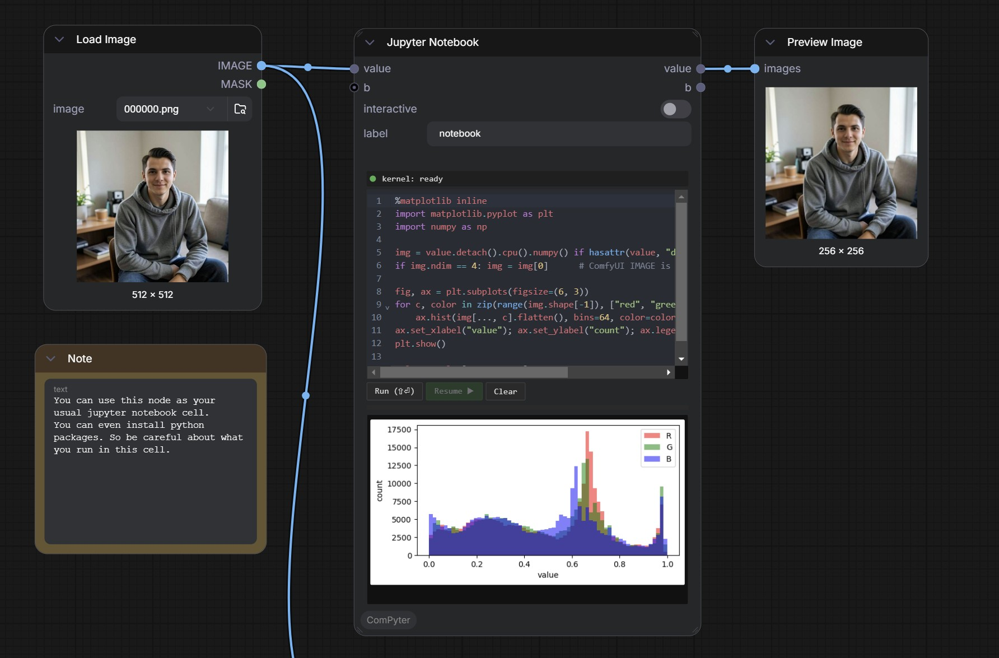
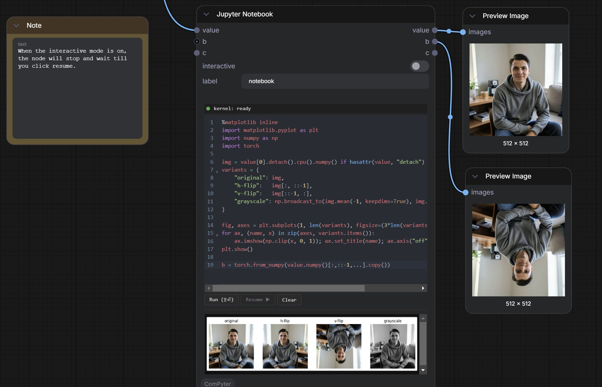

# ComPyter — Jupyter inside ComfyUI

Interactive Jupyter experience inside ComfyUI.

Have you ever tried debugging your inputs, or writing custom nodes and integrating them into ComfyUI? Hours spent sprinkling `print()`s into your node to catch bugs, figure out the input shape, or just see what's actually happening inside?

Now you can do that interactively, Jupyter-style. Drop in the node, add input and output nodes, run the workflow once, and the node's inputs are live in a Jupyter environment you can poke at. With **interactive mode on**, the workflow pauses until you click **Resume**. With it off, your saved code runs against the inputs once per queue and the workflow continues, propagating whatever you reassigned.

State persists inside the kernel between runs, so you can keep iterating on your code and polishing your functions. What a time to be alive.

The code is saved with the workflow and runs on every execution.

Two nodes, one persistent background IPython kernel:

- **Jupyter Notebook** — the default user-friendly node. Embeds a code-cell
  + rich-output area + Resume button **inside the node body**. No external
  front-end required.
- **Jupyter Breakpoint** — pro variant. Same pause semantics, no in-node
  UI; prints a copy-pasteable attach block so you can connect any external
  Jupyter front-end (`jupyter console --existing`, qtconsole, lab).

Both nodes accept and emit any type. Both share the same singleton kernel
and the same `value` / `label` / `resume()` in the namespace. Mix them
freely in one graph.

The kernel is started lazily on the first hit, served from a daemon thread
with a fixed connection file, and survives across queue runs — no ComfyUI
restart needed. Session, imports, and history persist between hits and
between queues (whether the node paused or ran non-interactively).

**Mutating `value` propagates downstream.** Whatever `value` is bound to in
the kernel namespace when the graph resumes (or after a non-interactive
queue) is what flows to the next node — so the Notebook is also an inline
Python *transform*, not just a viewer.



*Above: a Notebook node running the per-channel histogram recipe inline,
with the input still passing through to a Preview Image downstream.*

## Install

```bash
cd ComfyUI/custom_nodes
git clone <this repo> ComPyter
pip install -r ComPyter/requirements.txt   # into the env ComfyUI is using
# restart ComfyUI once
```

Requirements: `ipykernel`, `jupyter_client`. Python 3.10+.

Optional extras for nicer front-ends:

```bash
pip install qtconsole                       # GUI console with inline plots
pip install jupyter_existing_provisioner    # Lab GUI against an existing kernel
```

## Use — Jupyter Notebook (default)

Inputs (dynamic, up to 10 wildcard slots):

- `value` — anything (link). Required, always visible.
- `b` … `j` — additional wildcard inputs, optional. Hidden by default; the
  next empty slot appears whenever the trailing slot gets wired, up to 9
  optionals. Each is exposed in the kernel namespace under its slot name;
  mutating any of them in the cell rebinds the matching output.
- `mode` (3-way dropdown, default *kernel + pause*) — see *Modes* below.
- `session` (STRING, default `"default"`) — partitions kernel state.
  Nodes with the same value share variables; different values isolate.
  See *Shared kernel state and sessions* below.
- `code` (STRING, multiline) — the cell. Persists with the workflow.

The node's **title** (LiteGraph header — right-click → *Rename*) doubles
as the label: it's shown in the status bar (`paused @ <title>`), the
console banner for the Breakpoint variant, the error prefix, and is
bound to the `label` variable in the kernel. Title is sanitized
(NFKD → ASCII, spaces → underscores, punctuation dropped) before use.

Outputs: `value`, `b`, …, `j` — same names, same types as their inputs
(wildcard). Trailing unused slots collapse automatically.

### Modes

The `mode` dropdown decides what happens during a queue execution:

#### `kernel + pause` (default)
Pause the workflow and hand off to the in-node cell. `value` and `label`
are bound in the kernel namespace; everything else is whatever your
session has carried over.

```python
value.shape, value.dtype                        # tensor inspection
import matplotlib.pyplot as plt
plt.imshow(value[0].permute(1,2,0).cpu()); plt.show()   # inline plot
value = value[:, :256, :256, :]                 # crop -> flows downstream
```

Click **Resume ▶** to continue; whatever `value` is bound to at that
moment is what the next node sees. The kernel + session stay alive for
the next pause.

#### `kernel + continue`
No pause — run the saved `code` once on queue, in the persistent kernel
namespace, against the incoming `value`. Whatever your code rebinds is
what flows downstream.

```python
print(value.shape)
value = value[:, ::2, ::2, :]
print(value.shape)
```

`print()`, matplotlib figures, results, error tracebacks all render into
the node's output area within ~1s of queue completion. State (imports,
helpers, custom vars) carries across queues via the session.

#### `no kernel`
Run the saved `code` once on queue in a **throwaway** namespace
(no kernel involvement, no shared state). Stdout/stderr/errors still
render in the output area; matplotlib inline / rich display do not work
in this mode (no IPython hooks).

Use when you want a pure stateless transform and don't want the
side-effect of kernel state lingering.

---

The **Run** button (and Shift+Enter) always executes against the
persistent kernel using this node's `session`, regardless of mode — it's
for interactive exploration. After any queue, Run still lets you poke at
the last-seen `value`.

## Shared kernel state and sessions

One IPython kernel underlies every Notebook/Breakpoint in the graph, but
user variables are partitioned by the **`session`** STRING input on each
node (default `"default"`). Nodes with the same session string share a
namespace; nodes with different session strings can't see each other's
variables.

```python
# Node A   (session = "default")
OLOLO = value.mean(dim=(1, 2, 3))
helpers = {"crop": lambda x, k=256: x[:, :k, :k, :]}
```

```python
# Node B   (session = "default", later in the graph)
print(OLOLO)                # ✓ visible -- same session
value = helpers["crop"](value)
```

```python
# Node C   (session = "other")
print(OLOLO)                # NameError -- isolated namespace
```

The slot names themselves (`value`, `b` … `j`, `label`) are always
rebound from the incoming wires at the start of each run, regardless of
session — they're transport, not state.

IPython internals (`In`, `Out`, `_`, history, etc.) are **shared** across
sessions; only your own assignments get partitioned. So `_` after a cell
might come from a different session, but `OLOLO = ...` won't leak.

The **Run** button respects the session too — clicking Run in a node
executes against that node's session namespace, so interactive
exploration stays isolated as well.

**Ordering caveat.** ComfyUI only guarantees execution order along the
dependency graph. If two Notebooks share a session but aren't wired to
each other, ComfyUI may run them in either order, so node B can't
reliably see node A's state. Fix: wire **any** slot from A to B — even
just `value` straight through. That single edge forces `A → B`, and the
session state (your `OLOLO`, `helpers`, imports, …) rides along
automatically.

If you don't want to touch `value`, use a sentinel through one of the
optional slots:

```python
# Node A -- output b carries a tiny payload purely to create the edge
b = "A done"
```

```python
# Node B (wired: A.b -> B.b, same session)
# OLOLO, helpers, and anything else A defined are guaranteed available
```

## Recipes

All of these paste straight into the Notebook node's code cell and render
inline in the node's output panel. `%matplotlib inline` only needs to run
once per kernel session (so the first cell that uses pyplot).

### Per-channel image histogram

```python
%matplotlib inline
import matplotlib.pyplot as plt
import numpy as np

img = value.detach().cpu().numpy() if hasattr(value, "detach") else np.asarray(value)
if img.ndim == 4: img = img[0]      # ComfyUI IMAGE is BHWC -> first in batch

fig, ax = plt.subplots(figsize=(6, 3))
for c, color in zip(range(img.shape[-1]), ["red", "green", "blue", "gray"]):
    ax.hist(img[..., c].flatten(), bins=64, color=color, alpha=0.5, label="RGBA"[c])
ax.set_xlabel("value"); ax.set_ylabel("count"); ax.legend()
plt.show()
```

### Batch as a grid

Useful when `value` is a batch of generated images and you want to eyeball
them all at once.

```python
%matplotlib inline
import matplotlib.pyplot as plt
import numpy as np

imgs = value.detach().cpu().numpy() if hasattr(value, "detach") else np.asarray(value)
if imgs.ndim == 3: imgs = imgs[None]

n = imgs.shape[0]
cols = min(n, 4); rows = (n + cols - 1) // cols
fig, axes = plt.subplots(rows, cols, figsize=(3*cols, 3*rows), squeeze=False)
for i, ax in enumerate(axes.flat):
    if i < n:
        ax.imshow(np.clip(imgs[i], 0, 1))
        ax.set_title(f"#{i}", fontsize=9)
    ax.axis("off")
plt.tight_layout(); plt.show()
```

### Side-by-side: original vs transform

```python
%matplotlib inline
import matplotlib.pyplot as plt
import numpy as np
import torch

img = value[0].detach().cpu().numpy() if hasattr(value, "detach") else np.asarray(value[0])
variants = {
    "original": img,
    "h-flip":   img[:, ::-1],
    "v-flip":   img[::-1, :],
    "grayscale": np.broadcast_to(img.mean(-1, keepdims=True), img.shape),
}

fig, axes = plt.subplots(1, len(variants), figsize=(3*len(variants), 3))
for ax, (name, x) in zip(axes, variants.items()):
    ax.imshow(np.clip(x, 0, 1)); ax.set_title(name); ax.axis("off")
plt.show()

# Send the v-flipped image out on slot `b` so it flows to a second
# downstream node (dynamic IO: wiring `b`'s output makes the slot appear).
b = torch.from_numpy(value.numpy()[:, ::-1, ...].copy())
```



*Above: the cell renders the 4-variant comparison inline, while output
slot `b` carries the v-flipped tensor to a second Preview Image. The
optional `c` slot is empty, ready to be wired.*

### Batch as a GIF (animation)

Treats the batch dimension as time. Renders as `image/gif` — plays inline.

```python
import io, numpy as np, imageio
from IPython.display import display, Image

frames = value.detach().cpu().numpy() if hasattr(value, "detach") else np.asarray(value)
if frames.ndim == 3: frames = frames[None]
frames_u8 = (np.clip(frames, 0, 1) * 255).astype(np.uint8)

buf = io.BytesIO()
imageio.mimsave(buf, list(frames_u8), format="gif", fps=8, loop=0)
display(Image(data=buf.getvalue(), format="gif"))
```

Requires `imageio` in the ComfyUI env (`pip install imageio`).

### Stats table via pandas

A bare DataFrame as the last expression is auto-rendered via its
`_repr_html_` — comes out as a styled table in the output panel.

```python
import numpy as np
import pandas as pd

img = value[0].detach().cpu().numpy() if hasattr(value, "detach") else np.asarray(value[0])
flat = img.reshape(-1, img.shape[-1])
pd.DataFrame({
    "channel": list("RGBA")[:img.shape[-1]],
    "mean":    flat.mean(axis=0),
    "std":     flat.std(axis=0),
    "min":     flat.min(axis=0),
    "max":     flat.max(axis=0),
}).round(3)
```

### Interactive Plotly chart

Plotly emits `text/html` + inline JS via `display_data`, so it works as a
fully interactive widget inside the node (pan, zoom, hover).

```python
import numpy as np
import plotly.graph_objects as go

img = value[0].detach().cpu().numpy() if hasattr(value, "detach") else np.asarray(value[0])

fig = go.Figure(go.Heatmap(z=img.mean(axis=-1)[::-1], colorscale="Viridis"))
fig.update_layout(width=420, height=360, margin=dict(l=10,r=10,t=30,b=10),
                  title="brightness heatmap", paper_bgcolor="#111",
                  font=dict(color="#ddd"))
fig.show()
```

Requires `plotly` (`pip install plotly`).

### Pad / unpad to a multiple of N

A practical two-node pattern. Node A applies an explicit `pad_x` /
`pad_y` and *then* rounds the resulting dims up to be divisible by `n`
(e.g. 8 for a VAE, 64 for some samplers). It propagates the padded
image on `value` and the padding stats on slot `b`. Node B downstream
reads `b` and crops back to the original size. Works in any mode,
including `no kernel` — `b` is wired, not relying on shared state.

**Node A — pad** (`mode = kernel + continue` or `no kernel`):

```python
import torch.nn.functional as F

pad_x, pad_y = 16, 16     # explicit padding to apply
n           = 64          # final dims must be divisible by this

B, H, W, C = value.shape
target_h = -(-(H + pad_y) // n) * n           # ceil((H+pad_y)/n)*n
target_w = -(-(W + pad_x) // n) * n
pad_h, pad_w = target_h - H, target_w - W     # total pad incl. round-up

# F.pad expects BCHW with (left, right, top, bottom). Distribute the pad
# so the original image sits at the top-left -- simplest to crop back.
# Pad with 0 (black) so the padded region is visible in previews.
bchw = value.permute(0, 3, 1, 2)
padded = F.pad(bchw, (0, pad_w, 0, pad_h), mode="constant", value=0).permute(0, 2, 3, 1)

print(f"pad: {(H, W)} +({pad_y},{pad_x}) -> rounded {(target_h, target_w)}")

value = padded
b = {                # padding stats for the unpad node
    "orig_h": H, "orig_w": W,
    "pad_h": pad_h, "pad_w": pad_w,
    "pad_x": pad_x, "pad_y": pad_y, "n": n,
}
```

Wire `A.value → (your processing chain) → B.value`, and `A.b → B.b`.

**Node B — unpad**:

```python
oh, ow = b["orig_h"], b["orig_w"]
value = value[:, :oh, :ow, :]
print(f"unpad: {value.shape[1:3]} (was padded by h={b['pad_h']}, w={b['pad_w']})")
```

That's it — downstream nodes see the original-sized image again. The
example uses `mode="constant", value=0` so the padded region shows up
as black in previews (handy for sanity checking). For real pipelines
swap to `"reflect"` or `"replicate"` if a model upstream prefers a
non-zero pad.

### Note on `ipywidgets`

Full `ipywidgets` (sliders, dropdowns wired to Python callbacks) need a
two-way kernel↔browser bridge that the in-node renderer doesn't ship.
For that interactivity, prefer either:

- the **Jupyter Breakpoint** pro node + an external `jupyter qtconsole`
  or Lab front-end — those handle the widget comm protocol natively, and
- **plain HTML controls via `IPython.display.HTML`** for simple in-node UI:

```python
from IPython.display import display, HTML
display(HTML("""
<input type="range" min="0" max="100" oninput="this.nextElementSibling.value=this.value">
<output>50</output>
"""))
```

(The control is purely client-side; round-tripping its state to Python
needs an extra HTTP endpoint — out of scope for the default node.)

## Use — Jupyter Breakpoint (pro / headless)

1. Drop **Jupyter Breakpoint** (under `debug`) onto any wire.
2. Queue. ComfyUI's console prints a banner like:

   ```
   [Jupyter Breakpoint: breakpoint] paused. Connect a front-end:
     jupyter console   --existing /home/me/.local/share/jupyter/runtime/comfyui_jupyter_breakpoint.json
     jupyter qtconsole --existing /home/me/.local/share/jupyter/runtime/comfyui_jupyter_breakpoint.json
     Lab GUI: EXISTING_CONNECTION_FILE=... \
       jupyter lab --KernelProvisionerFactory.default_provisioner_name=existing-provisioner
   Then in a cell: inspect `value`, then call resume() to continue the graph.
   ```

3. Connect with any of those commands; `value`/`label`/`resume()` are in
   the namespace. Reassigning `value` propagates downstream after resume.
4. `resume()` continues the graph. Same kernel survives across queues.

Set `interactive=False` on **Jupyter Breakpoint** to make it a pure
passthrough (no pause, no attach block printed, fully cached).

## External front-end choices (Breakpoint node)

The plain Notebook / Lab server **doesn't** accept `--existing` against an
arbitrary kernel — by design, a Jupyter server only talks to kernels it
spawned. Three working options:

- **`jupyter console --existing <conn_file>`** — terminal REPL, zero setup.
- **`jupyter qtconsole --existing <conn_file>`** — Qt GUI, inline plots.
- **`jupyter lab` with the existing-provisioner shim** — full Lab UI,
  requires `pip install jupyter_existing_provisioner` and the env var:
  ```bash
  EXISTING_CONNECTION_FILE=<conn_file> \
    jupyter lab --KernelProvisionerFactory.default_provisioner_name=existing-provisioner
  ```

## Remote GPU (SSH tunnel)

The kernel binds `127.0.0.1` only. To attach from a workstation:

1. On the server, after the first hit, copy the connection file:
   ```bash
   cat ~/.local/share/jupyter/runtime/comfyui_jupyter_breakpoint.json
   ```
   Note the five ports under `shell_port`, `iopub_port`, `stdin_port`,
   `control_port`, `hb_port`.

2. From your workstation, open an SSH tunnel for those five ports:
   ```bash
   ssh -N \
     -L 5555:127.0.0.1:5555 \
     -L 5556:127.0.0.1:5556 \
     -L 5557:127.0.0.1:5557 \
     -L 5558:127.0.0.1:5558 \
     -L 5559:127.0.0.1:5559 \
     user@gpu-host
   ```
   Replace each pair with the actual port numbers from the JSON.

3. `scp` the connection file down (its `ip` is already `127.0.0.1`):
   ```bash
   scp user@gpu-host:~/.local/share/jupyter/runtime/comfyui_jupyter_breakpoint.json ./
   jupyter console --existing ./comfyui_jupyter_breakpoint.json
   ```

Alternative: run the front-end on the server and X-forward / VNC, or use
`code-server` / `jupyter lab` on the server with its own auth.

## Security

An open Jupyter kernel = arbitrary code execution in the ComfyUI process.
This node binds localhost only and never opens an external port. **Don't**
expose the ZMQ ports publicly; tunnel them over SSH.

## Verifying without ComfyUI

```bash
python smoketest.py
```

Starts the kernel manager standalone, prints the attach block, blocks until
`resume()` is called from a connected front-end. Useful for debugging the
kernel bring-up independently of ComfyUI.

## How it works (and why not `embed_kernel`)

`IPython.embed_kernel()` installs signal handlers and its own IOLoop every
time it's called and is unreliable across repeated invocations in a single
process — exactly the pattern a breakpoint inside a long-running ComfyUI
needs.

Instead this module starts **one** `IPKernelApp` in a daemon thread with a
shared `user_ns` dict. Each pause (or non-interactive run) mutates
`user_ns` in place; the in-node UI talks to the same kernel over ZMQ via a
`jupyter_client.BlockingKernelClient` driven by HTTP routes registered on
ComfyUI's own aiohttp server:

- `POST /compyter/execute` — runs a code cell, returns rich Jupyter
  outputs (`stream`, `execute_result`, `display_data`, `error`).
- `POST /compyter/resume` — releases a paused breakpoint.
- `GET  /compyter/status` — kernel started? currently paused? label?
- `GET  /compyter/outputs?node_id=<id>` — drains any outputs buffered by
  the last non-interactive queue execution of a specific node.

Three known off-main-thread / startup gotchas, all handled:

- A fresh asyncio event loop is set in the kernel thread (tornado's IOLoop
  wraps it). On Windows it's explicitly a `SelectorEventLoop`.
- `IPKernelApp.init_signal` calls `signal.signal(SIGINT, ...)` which raises
  off the main thread, so `signal.signal` is monkeypatched to a no-op for
  the duration of `initialize()`.
- ComfyUI's concurrent module loading can race with IPython's own startup
  ("dictionary changed size during iteration"). Kernel startup retries up
  to 8× with backoff, deleting the connection file between attempts so
  fresh random ports are picked each retry (avoids `Address in use`).

If the direct ipykernel route breaks on a future release, the same shared-
`user_ns` design works on top of `background_zmq_ipython`'s
`init_ipython_kernel(user_ns=ns)`.
